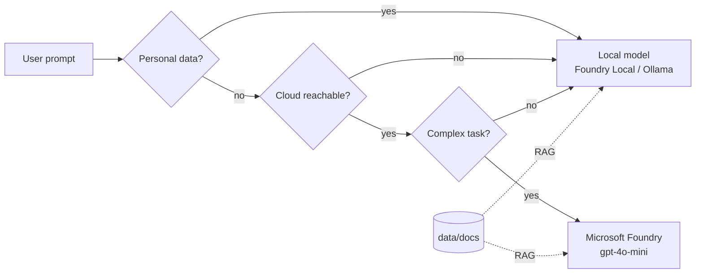

# Pycord - Building a Hybrid AI System with Python and Local Models

**PyCon Kenya 2026 workshop** - about 3 hours, hands-on.

You will build **Mela**, a bilingual (Kiswahili / English) assistant that uses **Microsoft Foundry** cloud models when they help and
**local models on your laptop** when you are offline, want to save money, or need to keep personal data private.

> [!TIP]
> **Attendees: start with the step-by-step [labs](labs/README.md).** Each lab has instructions, checkpoints and hidden solutions.



## Agenda

| Time | Module | Lab | File |
|---|---|---|---|
| 0:00 | Welcome and setup check | [Lab 00](labs/00-setup.md) | [workshop/00_setup_check.py](workshop/00_setup_check.py) |
| 0:20 | Hello, cloud (Microsoft Foundry) | [Lab 01](labs/01-hello-cloud.md) | [workshop/01_hello_cloud.py](workshop/01_hello_cloud.py) |
| 0:35 | Hello, local (Foundry Local / Ollama) | [Lab 02](labs/02-hello-local.md) | [workshop/02_hello_local.py](workshop/02_hello_local.py) |
| 0:50 | One interface for every model | [Lab 03](labs/03-unified-client.md) | [workshop/03_unified_client.py](workshop/03_unified_client.py) |
| 1:05 | Break | | |
| 1:15 | Hybrid router (offline fallback, cost, complexity) | [Lab 04](labs/04-hybrid-router.md) | [workshop/04_hybrid_router.py](workshop/04_hybrid_router.py) |
| 1:40 | Privacy guard for Kenyan personal data | [Lab 05](labs/05-privacy-guard.md) | [workshop/05_privacy_guard.py](workshop/05_privacy_guard.py) |
| 2:00 | Local RAG over your own documents | [Lab 06](labs/06-local-rag.md) | [workshop/06_local_rag.py](workshop/06_local_rag.py) |
| 2:25 | Agent with tools (stretch goal) | [Lab 07](labs/07-agent-tools.md) | [workshop/07_agent_tools.py](workshop/07_agent_tools.py) |
| 2:45 | Mela web app and demo | [Lab 08](labs/08-web-app.md) | [app/server.py](app/server.py) |
| 2:55 | Wrap-up | | |

Each module is a Python file split into cells with `# %%`. In VS Code, click **Run Cell** above each cell
(needs the Python and Jupyter extensions), or run the whole file with `python workshop/<file>.py`.

## 1. Prerequisites (do this before the workshop)

- Python 3.10 or newer, Git, VS Code with the Python and Jupyter extensions
- A laptop with at least 8 GB RAM
- An Azure account (free trial works) for the cloud modules
- A local model runtime - **one** of:
  - **Foundry Local** (Windows / macOS) - recommended
    - Windows: `winget install Microsoft.FoundryLocal`
    - macOS: `brew tap microsoft/foundrylocal` then `brew install foundrylocal`
  - **Ollama** (Windows / macOS / Linux) - from ollama.com

Download the local model **at home**, not on the conference Wi-Fi:

```bash
# Foundry Local
foundry model run phi-3.5-mini      # type /exit after it answers
# or Ollama
ollama pull qwen2.5:1.5b
```

## 2. Get the project and install it

Windows (PowerShell):

```powershell
git clone https://github.com/Malvine254/pycon-2026.git
cd pycon-2026
python -m venv .venv
.venv\Scripts\Activate.ps1
pip install -e ".[ui,web,dev]"
Copy-Item .env.example .env
```

macOS / Linux:

```bash
git clone https://github.com/Malvine254/pycon-2026.git
cd pycon-2026
python3 -m venv .venv
source .venv/bin/activate
pip install -e ".[ui,web,dev]"
cp .env.example .env
```

## 3. Set up Microsoft Foundry (cloud)

1. Go to https://ai.azure.com and create a **Foundry project**.
2. Deploy the model **gpt-4o-mini** and keep the deployment name `gpt-4o-mini`.
3. Copy the resource endpoint (looks like `https://<your-resource>.openai.azure.com`) into `FOUNDRY_ENDPOINT` in `.env`.
4. Sign in - pick one:
   - **Recommended:** install the Azure CLI, run `az login`, and make sure your account has the
     **Cognitive Services OpenAI User** role on the Foundry resource. Leave `FOUNDRY_API_KEY` empty.
   - **Quick option:** paste the key from the portal into `FOUNDRY_API_KEY`. Never commit `.env`.

## 4. Configure the local model

In `.env`:

| Runtime | Settings |
|---|---|
| Foundry Local | `LOCAL_RUNTIME=foundry-local`, `LOCAL_MODEL=phi-3.5-mini` (or `qwen2.5-0.5b` on slower laptops) |
| Ollama | `LOCAL_RUNTIME=ollama`, `OLLAMA_MODEL=qwen2.5:1.5b` |

## 5. Check everything works

```bash
python workshop/00_setup_check.py
pytest
```

All lines should show `[OK]`. If the cloud check fails you can still do modules 2, 5 and 6 offline.

## 6. Run the apps

**Mela agent web app** (chat with the tool-calling agent):

```bash
python app/server.py
```

Open http://127.0.0.1:8000. The UI is in **Kiswahili by default** - switch with **SW / EN** in the top bar; Mela also
replies in the chosen language. Choose **Auto**, **Local** or **Cloud** in the sidebar. Each answer shows the tools
the agent called (click to see arguments and results), the model, the time taken and the cost in KES.
In Auto mode, messages with personal data are answered by the local model only.

Upload PDF, Markdown, TXT or CSV files (max 5 MB) with the paperclip, the sidebar, or by dropping them on the page.
The agent can then search them. Uploads stay in memory only, and any personal data in them is redacted before
it is sent to a cloud model. Light and dark themes are supported, and the layout works on phones for live demos.

**Streamlit chat** (plain chat and RAG, no tools):

```bash
streamlit run app/streamlit_app.py
```

Pick **Auto (hybrid)**, **Local only** or **Cloud only** in the sidebar. Every answer shows which model replied,
how long it took, the tokens used, the cost in KES and why the router chose that model.

## Project layout

```
src/pycord/
  config.py            settings from .env
  providers/           base.py (interface), foundry.py (cloud), local.py (Foundry Local, Ollama)
  router.py            hybrid routing rules + fallback
  privacy.py           Kenyan PII detection and redaction
  rag.py               offline BM25 retrieval + RAG prompt
  agent.py             tool-calling agent
labs/                  step-by-step lab guides (start here)
workshop/              modules 00-07
app/server.py          agent web app (FastAPI + app/static/)
app/streamlit_app.py   Streamlit chat UI
data/docs/             sample knowledge base (add your own .md files)
tests/                 pytest suite (no network needed)
```

## Troubleshooting

| Problem | Fix |
|---|---|
| `FOUNDRY_ENDPOINT is not set` | Copy `.env.example` to `.env` and fill it in |
| `401` / `PermissionDenied` from Foundry | Run `az login` again or check the role assignment; or use `FOUNDRY_API_KEY` |
| `DeploymentNotFound` | `FOUNDRY_DEPLOYMENT` must match the deployment name in the portal |
| Local runtime not found | Check `foundry --version` / `ollama --version`, then open a new terminal |
| First local answer is very slow | The model is loading into memory; later calls are faster |
| Laptop runs out of memory | Use a smaller model: `qwen2.5-0.5b` (Foundry Local) or `qwen2.5:0.5b` (Ollama) |
| `ModuleNotFoundError: pycord` | Activate the virtual environment and run `pip install -e .` |

## Notes for facilitators

- Bring USB drives with Python wheels (`pip download -d wheels ".[ui,web,dev]"`) and the model files,
  so attendees can install with `pip install --no-index --find-links wheels -e ".[ui,web,dev]"`.
- A shared Foundry endpoint and key for the room can be handed out instead of personal Azure accounts.
  Rotate the key after the workshop.
- The documents in `data/docs` are sample data for the workshop, not official advice.
