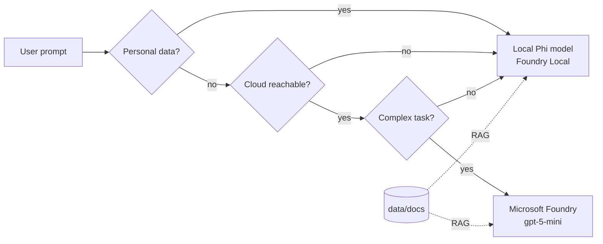

# Pycord - Building a Hybrid AI System with Python and Local Models

**PyCon Kenya 2026 workshop** - about 3 hours, hands-on.

You will build **Mela**, a bilingual (Kiswahili / English) assistant that uses **Microsoft Foundry** cloud models when they help and
**local models on your laptop** when you are offline, want to save money, or need to keep personal data private.

> [!TIP]
> **Attendees: start with the step-by-step [labs](labs/README.md).** Each lab has instructions, checkpoints and hidden solutions.



## Agenda

| Time | Module | Lab | File |
|---|---|---|---|
| 0:00 | Welcome and setup check | [Lab 00](labs/00-setup.md) | [workshop/00_setup_check.py](workshop/00_setup_check.py) |
| 0:20 | Hello, cloud (Microsoft Foundry) | [Lab 01](labs/01-hello-cloud.md) | [workshop/01_hello_cloud.py](workshop/01_hello_cloud.py) |
| 0:35 | Hello, local with Phi (Foundry Local) | [Lab 02](labs/02-hello-local.md) | [workshop/02_hello_local.py](workshop/02_hello_local.py) |
| 0:50 | One interface for every model | [Lab 03](labs/03-unified-client.md) | [workshop/03_unified_client.py](workshop/03_unified_client.py) |
| 1:05 | Break | | |
| 1:15 | Hybrid router (offline fallback, cost, complexity) | [Lab 04](labs/04-hybrid-router.md) | [workshop/04_hybrid_router.py](workshop/04_hybrid_router.py) |
| 1:40 | Privacy guard for Kenyan personal data | [Lab 05](labs/05-privacy-guard.md) | [workshop/05_privacy_guard.py](workshop/05_privacy_guard.py) |
| 2:00 | Local RAG over your own documents | [Lab 06](labs/06-local-rag.md) | [workshop/06_local_rag.py](workshop/06_local_rag.py) |
| 2:25 | Agent with tools (stretch goal) | [Lab 07](labs/07-agent-tools.md) | [workshop/07_agent_tools.py](workshop/07_agent_tools.py) |
| 2:45 | Mela web app and demo | [Lab 08](labs/08-web-app.md) | [app/server.py](app/server.py) |
| 2:55 | Wrap-up | | |

Each module is a Python file split into cells with `# %%`. In VS Code, click **Run Cell** above each cell
(needs the Python and Jupyter extensions), or run the whole file with `python workshop/<file>.py` after activating `.venv`.

## 1. Prerequisites

- Python 3.10 or newer, Git, VS Code with the Python and Jupyter extensions
- A laptop with at least 8 GB RAM
- **Microsoft Foundry access** - the facilitators give every attendee the Foundry login details (endpoint and key) at the workshop
- **Foundry Local with Phi** for the local model - install it before the workshop by following
  **[Lab 00, Step 2](labs/00-setup.md#step-2---install-and-start-the-local-model)** (the ~2.2 GB download is best done at home)

> [!NOTE]
> The local model is optional on the day. Without it, the labs and the app fall back to the cloud model and tell you how to install Phi.

## 2. Get the project and install it

Windows (PowerShell):

```powershell
git clone https://github.com/Malvine254/pycon-2026.git
cd pycon-2026
python -m venv .venv
.\.venv\Scripts\Activate.ps1
pip install -r requirements.txt
Copy-Item .env.example .env
```

After activation, your Windows prompt should begin with `(.venv) PS`. Keep using that terminal for all later Python, `pip`, and `pytest` commands.

macOS / Linux:

```bash
git clone https://github.com/Malvine254/pycon-2026.git
cd pycon-2026
python3 -m venv .venv
source .venv/bin/activate
pip install -r requirements.txt
cp .env.example .env
```

## 3. Add your Microsoft Foundry details

Use the Foundry login details from the facilitators. Copy them into `.env`:

```ini
FOUNDRY_ENDPOINT=https://<provided-resource>.openai.azure.com
FOUNDRY_API_KEY=<provided-key>
FOUNDRY_DEPLOYMENT=gpt-5-mini
FOUNDRY_API_VERSION=2025-08-07
```

Never commit `.env` or share the key in chat - `.env` is git-ignored.

## 4. Configure the local model

The defaults in `.env` already match the workshop:

```ini
LOCAL_RUNTIME=foundry-local
LOCAL_MODEL=phi-3.5-mini
```

Installing Foundry Local, starting the server, loading Phi and checking its port are covered step by step in
**[Lab 00, Step 2](labs/00-setup.md#step-2---install-and-start-the-local-model)**.

## 5. Check everything works

```bash
python workshop/00_setup_check.py
pytest
```

All lines should show `[OK]`. `[!!] Local runtime` is fine for now - the labs fall back to the cloud model.

## 6. Run the apps

**Mela agent web app** (chat with the tool-calling agent), from an activated PowerShell terminal:

```powershell
.\scripts\start_app.ps1
```

The script starts Foundry Local and loads Phi when they are installed, then starts the web app.
If Foundry Local is missing, it prints a warning and runs Mela with the cloud model only.
On macOS / Linux, start Foundry Local yourself and run `python app/server.py`.

Open http://127.0.0.1:8000. The UI is in **Kiswahili by default** - switch with **SW / EN** in the top bar; Mela also
replies in the chosen language. Choose **Auto**, **Local** or **Cloud** in the sidebar. Each answer shows the tools
the agent called (click to see arguments and results), the model, the time taken and the cost in KES.
In Auto mode, messages with personal data are answered by the local model only.

The default web settings are `APP_HOST=127.0.0.1` and `APP_PORT=8000` in `.env`. Change `APP_PORT` if another service uses that port; `scripts/start_app.ps1` uses the configured value when restarting FastAPI.

Upload PDF, Markdown, TXT or CSV files (max 5 MB) with the paperclip, the sidebar, or by dropping them on the page.
The agent can then search them. Uploaded knowledge, saved chats, and owner instructions are stored locally under
`.mela/` (which is git-ignored), and any personal data in document context is redacted before it is sent to a cloud model.
Use the sidebar to delete uploaded documents, reopen saved chats, or change Mela's additional instructions. Light and dark themes are supported, and the layout works on phones for live demos.

**Streamlit chat** (plain chat and RAG, no tools):

```bash
streamlit run app/streamlit_app.py
```

Pick **Auto (hybrid)**, **Local only** or **Cloud only** in the sidebar. Every answer shows which model replied,
how long it took, the tokens used, the cost in KES and why the router chose that model.

## Project layout

```
src/pycord/
  config.py            settings from .env
  providers/           base.py (interface), foundry.py (cloud), local.py (Foundry Local, Ollama)
  router.py            hybrid routing rules + fallback
  privacy.py           Kenyan PII detection and redaction
  rag.py               offline BM25 retrieval + RAG prompt
  agent.py             tool-calling agent
  documents.py         text extraction for uploads (PDF, MD, TXT, CSV)
  storage.py           local storage for uploads, chats and instructions (.mela/)
  labkit.py            lab helper: local model with cloud fallback
labs/                  step-by-step lab guides (start here)
workshop/              lab code, modules 00-07
app/server.py          Mela web app (FastAPI + app/static/)
app/streamlit_app.py   Streamlit chat UI
scripts/start_app.ps1  starts Foundry Local + Phi (if installed) and the web app
data/docs/             sample knowledge base (add your own .md files)
tests/                 pytest suite (no network needed)
```

## Troubleshooting

| Problem | Fix |
|---|---|
| `FOUNDRY_ENDPOINT is not set` | Copy `.env.example` to `.env` and fill in the facilitator-provided details |
| `401` / `PermissionDenied` from Foundry | Check `FOUNDRY_API_KEY` matches the key you were given |
| `DeploymentNotFound` | `FOUNDRY_DEPLOYMENT` must match the deployment name you were given |
| `foundry` is not recognized | Open a new terminal after installing Foundry Local - see [Lab 00, Step 2](labs/00-setup.md#step-2---install-and-start-the-local-model) |
| Local model not available | Run `foundry server start`, then `foundry model load phi-3.5-mini`, and check with `foundry server status` |
| First local answer is very slow | Phi is loading into memory; later calls are faster |
| Laptop runs out of memory | Close other apps, or use the optional Ollama runtime with `qwen2.5:0.5b` (Lab 00, Step 2) |
| `ModuleNotFoundError: pycord` | Activate the virtual environment and run `pip install -r requirements.txt` |

## Notes for facilitators

- Bring USB drives with Python wheels (`pip download -d wheels ".[ui,web,dev]"`) and the model files,
  so attendees can install with `pip install --no-index --find-links wheels -e ".[ui,web,dev]"`.
- Hand out the Foundry login details (endpoint and key) to attendees privately, and rotate the key after the workshop.
- The documents in `data/docs` are sample data for the workshop, not official advice.
