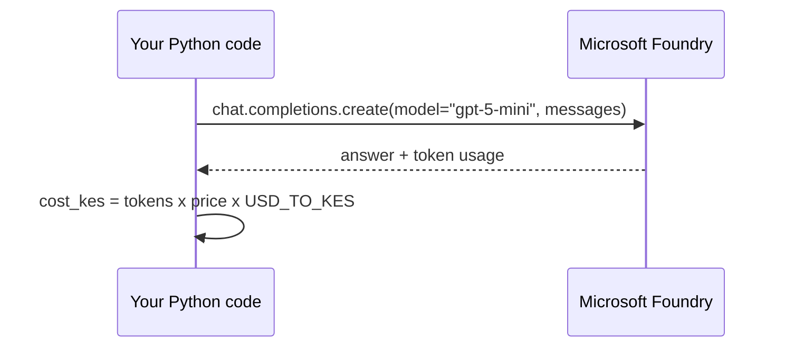

# Lab 01 - Hello, cloud (Microsoft Foundry)

> **Time:** 15 minutes · **Level:** Beginner · **Works offline:** No

[← Lab 00](00-setup.md) · [Lab index](README.md) · [Next: Lab 02 →](02-hello-local.md)

## Goal

Send your first prompt to a model deployed in **Microsoft Foundry**, and see the speed, tokens and cost in Kenya shillings.

**File:** [`workshop/01_hello_cloud.py`](../workshop/01_hello_cloud.py) · **Code to read:** [`src/pycord/providers/foundry.py`](../src/pycord/providers/foundry.py)



---

## Step 1 - Load the settings and the cloud provider

Open `workshop/01_hello_cloud.py` and run the **first cell**:

```python
from pycord.config import Settings
from pycord.providers import get_cloud_provider

settings = Settings.from_env()
cloud = get_cloud_provider(settings)
```

You should see your endpoint and the deployment name `gpt-5-mini` printed.

> [!NOTE]
> `Settings.from_env()` reads your `.env` file. Nothing is hard-coded, so the same code works for everyone.

## Step 2 - Ask a question

Run the **second cell**:

```python
result = cloud.ask(
    "In two sentences, why should a Kenyan Python developer learn about AI?",
    system="You are a friendly Kenyan tech mentor.",
)
print(result.text)
print(result.summary())
```

Example output (your text will differ):

```text
AI lets you build tools for Kenyan problems - from farming advice to M-Pesa fraud detection...
[foundry | gpt-5-mini | 1.21s | 38+52 tokens | KES 0.0047]
```

## Step 3 - Look under the hood

Run the **third cell**. It makes the same call with the raw `openai` SDK:

```python
response = cloud.client.chat.completions.create(
    model=settings.foundry_deployment,
    messages=[{"role": "user", "content": "Say 'Habari PyCon Kenya!' and nothing else."}],
)
```

> [!TIP]
> `cloud.client` is a standard `AzureOpenAI` client. Anything you learn about the OpenAI Python SDK works here too.

## How sign-in works

Open [`foundry.py`](../src/pycord/providers/foundry.py) and find `_build_client`:

- If `FOUNDRY_API_KEY` is set → it uses the key.
- Otherwise → it uses `DefaultAzureCredential`, which picks up your `az login`. **No secrets in code.**

## Checkpoint

- [ ] You got an answer from `gpt-5-mini`
- [ ] You can read the latency, tokens and KES cost from `result.summary()`

## Exercises

**1.** Call `cloud.ask(...)` with `temperature=0` and then `temperature=1`. Run each twice. What changes?

<details>
<summary>Solution</summary>

```python
for temp in (0, 1):
    for _ in range(2):
        print(temp, cloud.ask("Give me a name for a Kenyan tech meetup.", temperature=temp).text)
```

`temperature=0` gives (almost) the same answer every time; `temperature=1` is more creative and varied.

</details>

**2.** Ask the same question in Kiswahili. How good is the reply?

<details>
<summary>Solution</summary>

```python
print(cloud.ask("Kwa sentensi mbili, kwa nini msanidi programu wa Python nchini Kenya ajifunze AI?").text)
```

</details>

**3.** How many requests like this fit into a **KES 100** budget?

<details>
<summary>Solution</summary>

```python
print(int(100 / result.cost_kes), "requests")
```

With the default prices it is usually **thousands** of requests - cloud models are cheap per call, but costs add up across many users.

</details>

## Troubleshooting

| Error | Fix |
|---|---|
| `FOUNDRY_ENDPOINT is not set` | Fill in `.env` (Lab 00, Step 5) |
| `401` / `PermissionDenied` | Run `az login` again, or check the **Cognitive Services OpenAI User** role, or use `FOUNDRY_API_KEY` |
| `DeploymentNotFound` | `FOUNDRY_DEPLOYMENT` must match the deployment name in the portal exactly |
| `ConnectError` / timeout | You are offline - skip to [Lab 02](02-hello-local.md) and come back later |

---

[← Lab 00](00-setup.md) · [Lab index](README.md) · [Next: Lab 02 - Hello, local →](02-hello-local.md)
