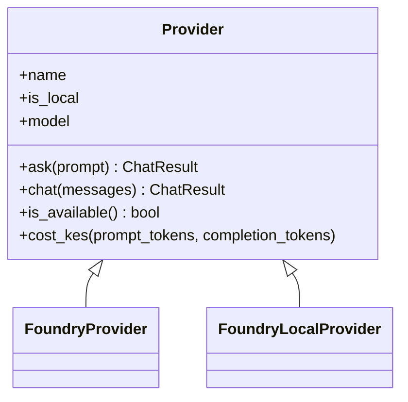

# Lab 03 - One interface: Phi and Foundry

> **Time:** 15 minutes · **Level:** Intermediate · **Works offline:** Partly

[← Lab 02](02-hello-local.md) · [Lab index](README.md) · [Next: Lab 04 →](04-hybrid-router.md)

## Goal

Use one Python interface to ask the same questions to local Phi and the cloud model.

**File:** [`workshop/03_unified_client.py`](../workshop/03_unified_client.py) · **Code to read:** [`src/pycord/providers/base.py`](../src/pycord/providers/base.py)



---

## Step 1 - Prepare the two providers

Before opening the workshop file:

1. Activate `.venv` using the instructions in the [lab guide](README.md).
2. Make sure Phi is running ([how](00-setup.md#step-2---install-and-start-the-local-model)): `foundry server start`, then `foundry model load phi-3.5-mini`.

    No Phi yet? The comparison skips the local model and keeps going.

3. Make sure the facilitator-provided cloud values are in `.env`.

To run the complete comparison from an activated Windows PowerShell terminal:

```powershell
(.venv) PS C:\Users\Home\Downloads\pycon-2026> $env:PYTHONPATH = "src"
(.venv) PS C:\Users\Home\Downloads\pycon-2026> python workshop/03_unified_client.py
```

The `(.venv) PS` text is your prompt, not something to type. In VS Code, the easier option is to open the workshop file and click **Run Cell** from top to bottom.

Open [`base.py`](../src/pycord/providers/base.py) and notice that every provider exposes the same `ask()`, `chat()`, `is_available()`, and `ChatResult` interface.

> [!TIP]
> The provider hides connection details so the workshop code can use local Phi and Foundry in the same way.

## Step 2 - Run the comparison

In VS Code, open [`workshop/03_unified_client.py`](../workshop/03_unified_client.py) and click **Run Cell** above the first two `# %%` blocks. The same three questions go to Phi and Foundry:

```text
Q: What is the capital city of Kenya?
  [foundry-local | Phi-3.5-mini... | 2.10s | 25+9 tokens | KES 0.0000]
    The capital city of Kenya is Nairobi.
    [foundry | gpt-5-mini | 0.84s | 25+8 tokens | KES 0.0007]
    The capital city of Kenya is Nairobi.
```

> [!NOTE]
> If you are offline, the cloud provider prints `not available, skipping` - the loop keeps going.

## Step 3 - Understand the result

Each provider returns the same `ChatResult`, including the answer, model name, latency, token counts, and estimated KES cost. Local Phi is free per request and can work offline; Foundry is useful for harder prompts.

## Checkpoint

- [ ] Phi and Foundry answered through the same provider interface
- [ ] You compared latency, model name, and cost

## Exercises

**Optional:** Implement a provider for another OpenAI-compatible server. Set its values before using it:

```powershell
$env:MY_PROVIDER_BASE_URL = "http://localhost:1234/v1"
$env:MY_PROVIDER_API_KEY = "not-needed"
```

The endpoint is environment-controlled; the exercise does not require LM Studio or any specific local server.

<details>
<summary>Solution</summary>

```python
import urllib.request

from openai import OpenAI

from pycord.providers import Provider


class MyProvider(Provider):
    name = "my-provider"
    is_local = True

    def _build_client(self) -> OpenAI:
        return OpenAI(base_url="http://localhost:1234/v1", api_key="not-needed")

    def is_available(self) -> bool:
        try:
            with urllib.request.urlopen("http://localhost:1234/v1/models", timeout=1.5) as response:
                return response.status == 200
        except OSError:
            return False
```

This is optional; it is not required for the workshop path.

</details>

**1.** Why do local providers return `0.0` from `cost_kes()`? When might that be wrong?

<details>
<summary>Answer</summary>

There is no per-request bill. But local models are not *free*: electricity, battery, and the laptop's time all cost something. In production you might count hardware cost per request too.

</details>

---

[← Lab 02](02-hello-local.md) · [Lab index](README.md) · [Next: Lab 04 - Hybrid router →](04-hybrid-router.md)
