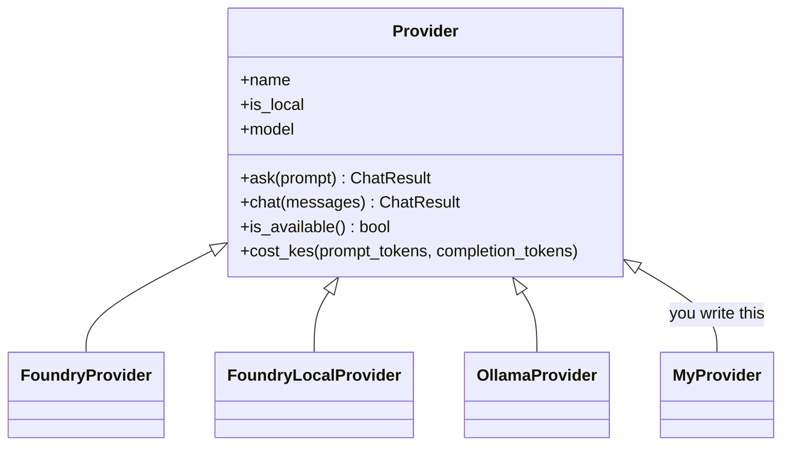

# Lab 03 - One interface, many models

> **Time:** 15 minutes · **Level:** Intermediate · **Works offline:** Partly

[← Lab 02](02-hello-local.md) · [Lab index](README.md) · [Next: Lab 04 →](04-hybrid-router.md)

## Goal

Understand the `Provider` abstraction that hides the differences between cloud and local models, and write your own provider.

**File:** [`workshop/03_unified_client.py`](../workshop/03_unified_client.py) · **Code to read:** [`src/pycord/providers/base.py`](../src/pycord/providers/base.py)



---

## Step 1 - Read the base class

Open [`base.py`](../src/pycord/providers/base.py). Notice:

- `client` is **lazy** - it is only created on first use (Foundry Local starts its service only when needed).
- `chat()` measures latency, reads token usage and computes cost - **once**, for every provider.
- Subclasses only implement `_build_client()` and `is_available()`.

> [!TIP]
> This is the *template method* pattern: shared behaviour in the base class, small differences in subclasses.

## Step 2 - Run the comparison

Run the first two cells. The same three questions go to every available provider:

```text
Q: What is the capital city of Kenya?
  [foundry-local | Phi-3.5-mini... | 2.10s | 25+9 tokens | KES 0.0000]
    The capital city of Kenya is Nairobi.
  [foundry | gpt-4o-mini | 0.84s | 25+8 tokens | KES 0.0007]
    The capital city of Kenya is Nairobi.
```

> [!NOTE]
> If you are offline, the cloud provider prints `not available, skipping` - the loop keeps going.

## Step 3 - Write your own provider

The last cell has a `MyProvider` skeleton for any OpenAI-compatible server (for example **LM Studio** on `http://localhost:1234/v1`). Complete `is_available()`.

## Checkpoint

- [ ] You can explain what `Provider.chat()` does for every provider
- [ ] You ran the same questions through local and cloud models

## Exercises

**1.** Implement `MyProvider.is_available()` so it returns `True` only when the server is running.

<details>
<summary>Solution</summary>

```python
import urllib.request

from openai import OpenAI

from pycord.providers import Provider


class MyProvider(Provider):
    name = "my-provider"
    is_local = True

    def _build_client(self) -> OpenAI:
        return OpenAI(base_url="http://localhost:1234/v1", api_key="not-needed")

    def is_available(self) -> bool:
        try:
            with urllib.request.urlopen("http://localhost:1234/v1/models", timeout=1.5) as response:
                return response.status == 200
        except OSError:
            return False
```

`urllib.error.URLError` is a subclass of `OSError`, so one `except` covers "server not running" and timeouts.

</details>

**2.** Why do local providers return `0.0` from `cost_kes()`? When might that be wrong?

<details>
<summary>Answer</summary>

There is no per-request bill. But local models are not *free*: electricity, battery, and the laptop's time all cost something. In production you might count hardware cost per request too.

</details>

---

[← Lab 02](02-hello-local.md) · [Lab index](README.md) · [Next: Lab 04 - Hybrid router →](04-hybrid-router.md)
