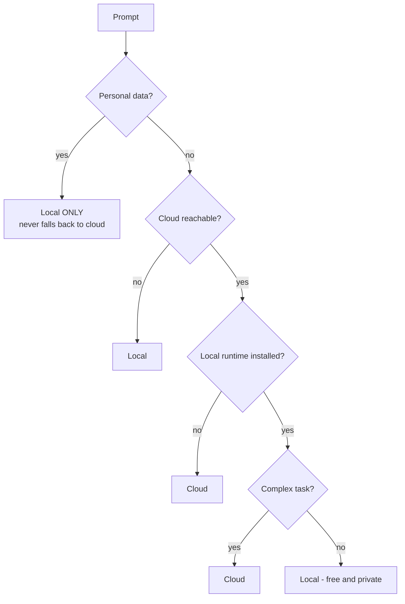

# Lab 04 - The hybrid router

> **Time:** 25 minutes · **Level:** Intermediate · **Works offline:** Partly

[← Lab 03](03-unified-client.md) · [Lab index](README.md) · [Next: Lab 05 →](05-privacy-guard.md)

## Goal

Build the "brain" of the hybrid system: a router that decides, **per request**, whether to use the local or the cloud model - and falls back automatically when something fails.

**File:** [`workshop/04_hybrid_router.py`](../workshop/04_hybrid_router.py) · **Code to read:** [`src/pycord/router.py`](../src/pycord/router.py)

## The rules (in order)



If the chosen model fails, the router tries the other one - **except** for personal data.

---

## Step 1 - See the decisions

Run the first cell. `router.decide()` only *decides* - it does not call any model:

```text
local | simple task - local is free and private | Habari yako?
cloud | complex task - using the bigger cloud model | Compare Django and FastAPI ... step by step.
local | personal data detected - keeping it on this device | My number is 0712345678, remind me to pay rent.
```

> [!NOTE]
> "Complex" is a simple heuristic in `is_complex()`: long prompts, or words like *compare*, *step by step*, *summarize*, *translate*. Simple, explainable rules beat clever ones in a workshop - and often in production too.

## Step 2 - Route real requests

Run the second cell. Each answer shows **which model** answered and **why**:

```text
[foundry-local | ... | KES 0.0000] - simple task - local is free and private
[foundry | gpt-4o-mini | ... | KES 0.0102] - complex task - using the bigger cloud model
```

## Step 3 - Simulate a network outage

Run the third cell. It points the cloud provider at `https://offline.invalid`:

```text
[foundry-local | ...] - cloud unreachable - working offline
```

The app **keeps working**. That is the whole point of hybrid.

## Step 4 - Read the safety net

Open [`router.py`](../src/pycord/router.py) and find `chat()`:

- It checks **all user messages** in the conversation for personal data, not just the last one.
- On failure it falls back - unless `allow_fallback=False` (personal data).

> [!IMPORTANT]
> These rules are covered by tests in [`tests/test_router.py`](../tests/test_router.py). Run `pytest tests/test_router.py -v` to see them.

## Checkpoint

- [ ] You can name the 5 routing rules in order
- [ ] You saw the router keep working with an unreachable cloud

## Exercises

**1.** Add a rule: questions in **Kiswahili** go to the cloud for better quality.

<details>
<summary>Solution</summary>

In `src/pycord/router.py`, add a helper (`re` is already imported in `privacy.py`, so add `import re` at the top of `router.py`):

```python
SWAHILI_HINTS = {"nini", "gani", "jinsi", "habari", "tafadhali", "ngapi", "lini"}


def is_swahili(text: str) -> bool:
    return bool(SWAHILI_HINTS & set(re.findall(r"\w+", text.lower())))
```

Then in `HybridRouter.decide`, just before the `is_complex` check:

```python
        if is_swahili(text):
            return RouteDecision("cloud", "Kiswahili - using the cloud model for better quality")
```

Because it comes **after** the personal-data rule, Kiswahili messages with a phone number still stay local.

</details>

**2.** Add a **daily budget**: once the total cloud cost passes KES 50, route everything locally.

<details>
<summary>Solution</summary>

```python
from pycord.router import HybridRouter, RouteDecision


class BudgetRouter(HybridRouter):
    def __init__(self, local, cloud, budget_kes: float = 50.0):
        super().__init__(local, cloud)
        self.budget_kes = budget_kes
        self.spent_kes = 0.0

    def decide(self, text):
        decision = super().decide(text)
        if decision.target == "cloud" and self.spent_kes >= self.budget_kes and self.local.is_available():
            return RouteDecision("local", f"budget of KES {self.budget_kes:.0f} used up")
        return decision

    def chat(self, messages, **kwargs):
        result = super().chat(messages, **kwargs)
        self.spent_kes += result.cost_kes
        return result
```

Try it with `budget_kes=0.001` so you hit the limit quickly.

</details>

**3.** Write a test for your new rule in `tests/test_router.py` using the `make()` helper.

<details>
<summary>Solution</summary>

```python
def test_swahili_goes_cloud():
    router, _, _ = make()
    assert router.ask("Habari, nini maana ya AI?").provider == "cloud"
```

</details>

---

[← Lab 03](03-unified-client.md) · [Lab index](README.md) · [Next: Lab 05 - Privacy guard →](05-privacy-guard.md)
