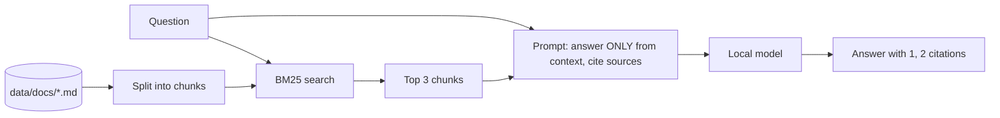

# Lab 06 - Local RAG (answers from your own documents)

> **Time:** 25 minutes · **Level:** Intermediate · **Works offline:** **Yes**

[← Lab 05](05-privacy-guard.md) · [Lab index](README.md) · [Next: Lab 07 →](07-agent-tools.md)

## Goal

Make the model answer from **your documents** instead of its memory, with citations - fully offline.

**File:** [`workshop/06_local_rag.py`](../workshop/06_local_rag.py) · **Code to read:** [`src/pycord/rag.py`](../src/pycord/rag.py) · **Documents:** [`data/docs/`](../data/docs)

## Before you start

In a terminal with `(.venv)` active, load local Phi:

```powershell
foundry server start
foundry model load phi-3.5-mini
```

This lab does not need the FastAPI app. It searches the sample documents directly from the Python cell.



> [!NOTE]
> **Why BM25 and not embeddings?** BM25 is keyword search in ~40 lines of pure Python: no model download, no vector database, works on any laptop offline. It is a strong baseline - try it before reaching for heavier tools.

---

## Step 1 - Load and chunk the documents

In VS Code, click **Run Cell** above the first `# %%` block. This is Python code; do not paste it into PowerShell:

The cell prints a line such as `Loaded 6 chunks from .../data/docs`. That line is normal output. Do not run or paste it as a PowerShell command.

```text
Loaded 6 chunks from .../data/docs
```

Each Markdown file is split on blank lines into chunks of up to ~800 characters (`chunk_text()`).

## Step 2 - Search

Click **Run Cell** above the second `# %%` block:

```text
4.12  maize_farming.md: 'A common spacing is 75 cm between rows ...'
```

The highest score should come from `maize_farming.md`.

## Step 3 - Ask questions grounded in the documents

Click **Run Cell** above the third `# %%` block. It asks three questions - including one in **Kiswahili**.
It uses the local model when installed; otherwise it prints install instructions and uses the cloud model:

```text
Q: Nifanye nini nikipokea ujumbe wa ulaghai?
Usitume pesa... Tuma ujumbe wa ulaghai kwa 333 [1].
```

Open [`rag.py`](../src/pycord/rag.py) and read `RAG_SYSTEM_PROMPT`. It tells the model to:

1. answer **only** from the context,
2. say "I don't know" otherwise,
3. cite sources like `[1]`,
4. reply in the question's language.

## Checkpoint

- [ ] You saw the right document ranked first
- [ ] You got an answer with a citation, offline

## Exercises

**1.** Add your own document to `data/docs/` (for example your meetup FAQ or county services) and ask about it.

<details>
<summary>Example</summary>

Create `data/docs/meetup_faq.md`:

```markdown
# Nairobi Python Meetup FAQ

## When do we meet?

On the last Saturday of every month, 10am to 1pm.
```

Return to the relevant VS Code cell and click **Run Cell** again, then ask: *"When does the Nairobi Python meetup happen?"*

</details>

**2.** Ask something that is **not** in the documents. Does the model admit it doesn't know?

**3.** Swap the local model for the cloud model and compare the answers.

<details>
<summary>Solution</summary>

```python
from pycord.providers import get_cloud_provider

cloud = get_cloud_provider(Settings.from_env())
hits = retriever.search("When should I plant maize?")
print(cloud.chat(build_rag_messages("When should I plant maize?", hits)).text)
```

</details>

---

[← Lab 05](05-privacy-guard.md) · [Lab index](README.md) · [Next: Lab 07 - Agent with tools →](07-agent-tools.md)
