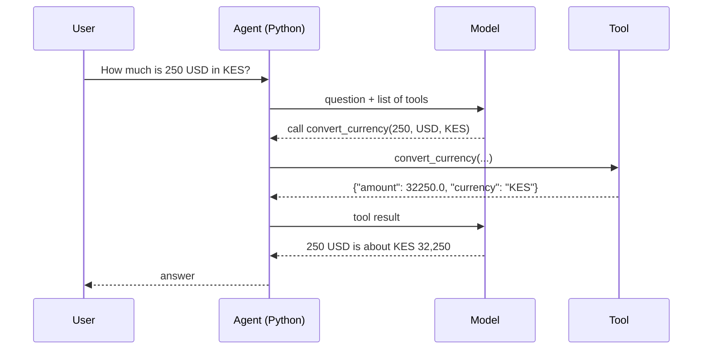

# Lab 07 - Agent with tools

> **Time:** 20 minutes · **Level:** Intermediate · **Works offline:** No (cloud model recommended)

[← Lab 06](06-local-rag.md) · [Lab index](README.md) · [Next: Lab 08 →](08-web-app.md)

## Goal

Turn the model into an **agent**: it decides which Python function to call, we run it safely, and it uses the result to answer.

**File:** [`workshop/07_agent_tools.py`](../workshop/07_agent_tools.py) · **Code to read:** [`src/pycord/agent.py`](../src/pycord/agent.py)



## The tools

| Tool | What it does |
|---|---|
| `convert_currency` | KES, USD, EUR, UGX, TZS (fixed workshop rates) |
| `nairobi_time` | Current date and time in EAT (UTC+3) |
| `search_docs` | BM25 search over the knowledge base from Lab 06 |

---

## Step 1 - Create the agent

In VS Code, click **Run Cell** above the first `# %%` block. This is Python code; do not paste it into PowerShell:

```text
Tools: ['convert_currency', 'nairobi_time', 'search_docs']
```

## Step 2 - Ask questions that need tools

Click **Run Cell** above the second `# %%` block. Watch the `-> tool` lines - that is the model choosing tools:

```text
Q: How much is 250 USD in KES?
  -> tool convert_currency({"amount":250,"from_currency":"USD","to_currency":"KES"})
A: 250 USD is approximately KES 32,250.

Q: What spacing should I use for maize, and what time is it now?
  -> tool search_docs({"query":"maize spacing"})
  -> tool nairobi_time({})
A: Use 75 cm between rows and 25-30 cm between plants [maize_farming.md]. It is 10:42 in Nairobi.
```

> [!TIP]
> The second question needs **two** tools. The model can call several tools in one step - the agent loop handles it.

## Step 3 - Read the safety rules

Open [`agent.py`](../src/pycord/agent.py) and find `call_tool`:

- Only functions in the **allow-list** (`self.functions`) can run - the model cannot call arbitrary code.
- Bad JSON or wrong arguments become an `{"error": ...}` result instead of crashing.
- `max_steps=5` stops runaway loops.
- `search_docs` **redacts personal data** when the agent runs on a cloud model.

> [!WARNING]
> Never give an agent a tool like `run_shell(command)` or `eval(code)`. Every tool is an attack surface: the model's arguments are untrusted input.

## Checkpoint

- [ ] You saw the agent call at least one tool
- [ ] You can explain why tools are allow-listed

## Exercises

**1.** Add a tool `mpesa_fee(amount)` that returns a (made-up) transaction fee.

<details>
<summary>Solution</summary>

In `src/pycord/agent.py`, add the function:

```python
def mpesa_fee(amount: float) -> dict[str, Any]:
    amount = float(amount)
    fee = 0 if amount <= 100 else 15 if amount <= 1000 else 30  # made-up workshop tiers
    return {"amount": amount, "fee_kes": fee, "note": "made-up workshop fees"}
```

Add its schema to `TOOLS`:

```python
    {
        "type": "function",
        "function": {
            "name": "mpesa_fee",
            "description": "Get the (example) M-Pesa fee for sending an amount in KES.",
            "parameters": {
                "type": "object",
                "properties": {"amount": {"type": "number"}},
                "required": ["amount"],
            },
        },
    },
```

And register it in `Agent.__init__`:

```python
        self.functions: dict[str, Callable[..., Any]] = {
            "convert_currency": convert_currency,
            "nairobi_time": nairobi_time,
            "mpesa_fee": mpesa_fee,
        }
```

Restart the kernel and ask: *"What is the fee to send KES 500?"*

</details>

**2.** Try the agent with the **local** provider. Does the small model call tools correctly?

<details>
<summary>Solution</summary>

```python
from pycord.providers import get_local_provider

local_agent = Agent(get_local_provider(settings), retriever=agent.retriever)
print(local_agent.run("How much is 100 USD in KES?"))
```

The local Phi path is intentionally text-only for reliability. Tool-heavy tasks are routed to the cloud model, where the allow-listed tools are supported.

</details>

**3.** Ask in Kiswahili: *"Bei ya dola 100 ni shilingi ngapi za Kenya?"* Does the agent still pick the right tool?

---

[← Lab 06](06-local-rag.md) · [Lab index](README.md) · [Next: Lab 08 - Mela web app →](08-web-app.md)
