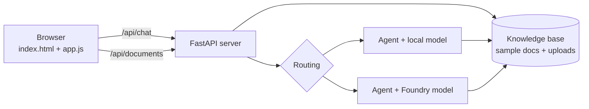

# Lab 08 - Mela web app and demo

> **Time:** 15 minutes · **Level:** Beginner · **Works offline:** Partly

[← Lab 07](07-agent-tools.md) · [Lab index](README.md)

## Goal

Run **Mela** - the full hybrid assistant in a web app - upload your own files, switch between **Kiswahili and English**, and practise a 5-minute demo.

**Code to read:** [`app/server.py`](../app/server.py) (FastAPI) · [`app/static/`](../app/static) (HTML, CSS, JS) · [`app/static/i18n.js`](../app/static/i18n.js) (translations)



---

## Step 1 - Start the server

```powershell
.\scripts\start_app.ps1
```

Open **http://127.0.0.1:8000**.

> [!NOTE]
> The server only listens on `127.0.0.1` (your own laptop). Nobody else on the conference Wi-Fi can reach it.

> [!TIP]
> Mela is a general assistant grounded by RAG. Ask normal questions, then try the sample maize, M-Pesa, and workshop documents to see retrieval improve the answer. Local Phi receives retrieved passages directly; cloud Mela uses the allow-listed `search_docs` tool.

## Step 2 - Take the tour

| Area | What to try |
|---|---|
| **Top bar → SW / EN** | Switch the whole UI between Kiswahili (default) and English. Mela also *replies* in the chosen language. |
| **Sidebar → Uelekezaji / Routing** | *Otomatiki/Auto*, *Kifaa/Local*, *Wingu/Cloud* |
| **Sidebar → Modeli / Models** | Green dot = available, red = not available |
| **Sidebar → Maarifa / Knowledge** | Sample docs + your uploads, with chunk counts and **PII** tags |
| **Suggestion cards** | One click to try currency, time, documents and M-Pesa safety |
| **Under each answer** | Tools used (click to expand), model, time, cost in KES, why it was routed there |
| **Moon / sun icon** | Dark and light themes |

## Step 3 - Upload a document

1. Create `notes.md` on your desktop:

   ```markdown
   PyCon Kenya hackathon: the prize is a Raspberry Pi. Contact the organiser on 0712345678.
   ```

2. Drag it onto the page (or use the paperclip).
3. A toast confirms the upload and warns that **personal data will be redacted for the cloud**. The file gets a **PII** tag.
4. Ask: *"Zawadi ya hackathon ni nini?"* (What is the hackathon prize?)
5. Expand **Imetumia search_docs / Used search_docs** - on the cloud model, the phone number appears as `[PHONE_KE]`.

> [!IMPORTANT]
> Uploaded knowledge is stored locally under `.mela/uploads/`, limited to PDF / MD / TXT / CSV, 5 MB each, 20 files total. Delete uploaded documents from the Knowledge sidebar when they are no longer needed. `.mela/` is git-ignored.

> [!TIP]
> Mela is general-purpose but grounded in the workshop knowledge base: maize farming, M-Pesa safety, workshop FAQ, and documents you upload. Local Phi uses retrieved context without cloud access; cloud Mela can also use the allow-listed tools.

## Step 4 - Show the privacy guard

In **Auto** mode, type: *"Nitumie ukumbusho kwa 0712345678"* (Send me a reminder on 0712345678).

- With a local model: the footer says *data binafsi imegunduliwa - imebaki kwenye kifaa hiki*.
- Without a local model: Mela **refuses** to send it to the cloud.

The security demonstration is visible in three places: the route footer explains why the model was selected, document results are redacted before cloud calls, and local runtime data stays under the git-ignored `.mela/` folder.

## Step 5 - Explain the security model

1. Mela detects Kenyan phone numbers, IDs, KRA PINs, M-Pesa codes, and email addresses.
2. Auto mode keeps messages containing personal data on the local model.
3. Cloud document context is redacted before it leaves the laptop.
4. Uploaded files stay on this laptop under `.mela/uploads/` and can be deleted from the Knowledge sidebar.
5. Chats and owner instructions are stored under `.mela/`; the folder is git-ignored and should not be shared.
6. Tools are allow-listed; Mela cannot execute arbitrary code or access a user's accounts.

The API is bound to `127.0.0.1` for the workshop. Never share `.env`, API keys, uploaded documents, or screenshots containing personal data.

## Step 6 - Practise the 5-minute demo

| Minute | Do this | Say this |
|---|---|---|
| 0-1 | Open Mela in Kiswahili, click the currency card | "One assistant, cloud brains, local privacy." |
| 1-2 | Expand the tool step | "The model chose a Python tool; we only run allow-listed functions." |
| 2-3 | Drop a PDF/notes file, ask about it | "Your own documents, searched offline with BM25." |
| 3-4 | Send a message with a phone number | "Kenyan personal data never leaves the laptop." |
| 4-5 | Turn off Wi-Fi, ask again | "No internet? Still works - that's hybrid." |

## Checkpoint

- [ ] Mela runs at http://127.0.0.1:8000
- [ ] You uploaded a file and asked about it
- [ ] You switched between SW and EN

## Exercises

**1.** Add a fifth suggestion card.

<details>
<summary>Solution</summary>

In `app/static/index.html`, copy a `<button class="card" ...>` block and set `data-card="weather"` (and a `data-icon`). In `app/static/i18n.js`, add to `cards` in **both** `sw` and `en`:

```js
weather: { title: "Hali ya hewa", sub: "Mvua ndefu huanza lini?", prompt: "Mvua ndefu huanza lini Kenya?" },
```

</details>

**2.** Change the brand colour. All colours are CSS variables at the top of [`styles.css`](../app/static/styles.css) - try `--green: #bb1e10;`.

**3.** Call the API directly - the UI is just one client:

<details>
<summary>Solution</summary>

```powershell
Invoke-RestMethod http://127.0.0.1:8000/api/chat -Method Post -ContentType "application/json" `
  -Body '{"message": "Habari?", "mode": "auto", "language": "sw"}'
```

```bash
curl -s http://127.0.0.1:8000/api/chat -H "Content-Type: application/json" \
  -d '{"message": "Habari?", "mode": "auto", "language": "sw"}'
```

Interactive API docs are at **http://127.0.0.1:8000/docs**.

</details>

---

## You did it

You built a hybrid AI system that is **fast** (local), **smart** (cloud), **private** (PII guard), **grounded** (RAG), **useful** (tools) and **local-first** (Kiswahili + offline).

**Next steps:** add your own tools and documents, try other Foundry models, or deploy Mela for your community. Asante sana!

[← Lab 07](07-agent-tools.md) · [Lab index](README.md)
