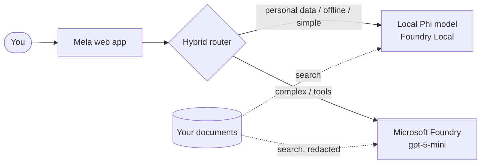

# Pycord Labs - Building a Hybrid AI System with Python and Local Models

**PyCon Kenya 2026 · Hands-on workshop · About 3 hours**

Welcome! In these labs you will build **Mela**, a bilingual (Kiswahili / English) AI assistant that:

- uses **Microsoft Foundry** cloud models for hard tasks,
- runs **local models on your laptop** when you are offline, want to save money, or need privacy,
- **never sends Kenyan personal data** (phone numbers, M-Pesa codes, KRA PINs, ID numbers) to the cloud,
- answers questions from **your own documents**, and
- calls **Python tools** as an agent, all inside a polished web app.



## Learning path

| Lab | Title | Time | Offline? | You will build |
|---|---|---|---|---|
| [00](00-setup.md) | Setup and environment check | 20 min | Partly | A working Python environment, `.env`, models ready |
| [01](01-hello-cloud.md) | Hello, cloud | 15 min | No | Your first call to a Microsoft Foundry model |
| [02](02-hello-local.md) | Hello, local with Phi | 15 min | **Yes** | The same call, running on Foundry Local |
| [03](03-unified-client.md) | One interface, many models | 15 min | Partly | A `Provider` abstraction + your own provider |
| | Break | 10 min | | |
| [04](04-hybrid-router.md) | The hybrid router | 25 min | Partly | Rules that pick local vs cloud, with fallback |
| [05](05-privacy-guard.md) | Privacy guard for Kenyan data | 20 min | **Yes** | PII detection, redaction, local-only routing |
| [06](06-local-rag.md) | Local RAG | 25 min | **Yes** | Answers grounded in your own documents |
| [07](07-agent-tools.md) | Agent with tools | 20 min | No | A tool-calling agent (currency, time, search) |
| [08](08-web-app.md) | Mela web app and demo | 15 min | Partly | The full app with uploads and Kiswahili UI |

> [!TIP]
> Every lab has the same shape: **goal → steps → checkpoint → exercises (with hidden solutions) → troubleshooting**.
> If you fall behind, copy the solution from the collapsible block and keep going.

## How to run the lab code

Each lab has a matching file in [`workshop/`](../workshop). The files are split into cells with `# %%`:

- **VS Code (recommended):** open the file, click **Run Cell** above the first cell, and continue from top to bottom. Output appears in the Interactive window.
- **Terminal:** activate the environment, set the source path, then run the file from the project folder:

    ```powershell
    .\.venv\Scripts\Activate.ps1
    $env:PYTHONPATH = "src"
    python workshop/01_hello_cloud.py
    ```

    Replace the filename with the workshop file for the lab you are taking.

> [!NOTE]
> A `# %%` line marks a runnable cell; it is not something you type into the terminal. If a cloud lab fails because the provided endpoint or key is missing, skip to the local Phi lab and ask a facilitator for the shared settings.

> [!IMPORTANT]
> Lines printed by a cell, such as `Loaded 6 chunks from ...`, are **output**, not commands. Read them; do not paste them back into PowerShell. Do not share `.env`, API keys, chat history, or private uploaded documents publicly.

> [!IMPORTANT]
> Run files under `workshop/` for the lab exercises. Files under `src/pycord/` are library modules to read or import, not standalone scripts; do not use **Run Python File** on them.

> [!IMPORTANT]
> Always activate the virtual environment first: `.\.venv\Scripts\Activate.ps1` (Windows) or `source .venv/bin/activate` (macOS / Linux). The leading `.` tells PowerShell to run the script in the current shell. On Windows, confirm the prompt begins with `(.venv) PS` before running any lab command.

## Conventions used in the labs

| You see | Meaning |
|---|---|
| A fenced `python` block under a cell step | Paste or run it in the VS Code Python/Jupyter cell; do not paste it into PowerShell |
| A fenced `powershell` or `bash` block | Run it in the matching terminal after activating `.venv` |
| `PS>` | Run in Windows PowerShell |
| `$` | Run in macOS / Linux terminal |
| > [!NOTE] | Background information |
| > [!TIP] | A shortcut or good practice |
| > [!WARNING] | Something that can go wrong |
| Checkpoint | Stop and confirm before moving on |

## Need help?

- Raise your hand - facilitators are walking around.
- Check the **Troubleshooting** section at the end of each lab.
- The full project README is [here](../README.md).

**Ready? Start with [Lab 00 - Setup](00-setup.md).**
